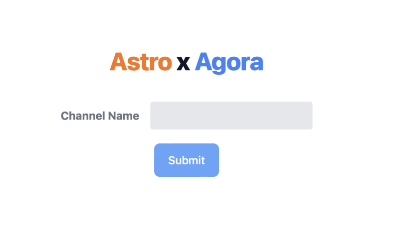

# Video Call Feature - Mindful Performance

A real-time video calling feature integrated into the Mindful Performance platform using Astro, React, and Agora RTC.




## Overview

This component provides real-time video conferencing functionality for Mindful Performance, allowing coaches and athletes to connect face-to-face virtually. The implementation uses Astro for server-side rendering with React for the interactive components, and Agora's RTC SDK for the video call infrastructure.

## Features

- **Channel-based Calls**: Create or join existing video call rooms via unique channel names
- **Real-time Video & Audio**: High-quality video and audio streaming
- **Dynamic Layout**: Responsive design that adjusts based on the number of participants
- **Simple Interface**: Minimal UI for distraction-free coaching sessions
- **Server-side Rendering**: Fast initial load times with Astro's SSR capabilities

## Technology Stack

- **Framework**: Astro with React integration
- **Video SDK**: Agora RTC React
- **Styling**: Tailwind CSS
- **Deployment**: Netlify

## Setup and Configuration

### Prerequisites

- Node.js (v14 or newer)
- Agora Developer Account and App ID
- npm or yarn

### Installation

1. Clone the repository:
   ```bash
   git clone https://github.com/yourusername/mindful-performance-videocall.git
   cd mindful-performance-videocall
   ```

2. Install dependencies:
   ```bash
   npm install
   ```

3. Create a `.env` file in the root directory:
   ```
   PUBLIC_AGORA_APP_ID=your_agora_app_id
   ```
   Replace `your_agora_app_id` with your actual Agora App ID from the Agora Console.

### Running Locally

```bash
npm run dev
```

The application will be available at `http://localhost:3000`.

## Usage

1. **Starting a Call**:
   - Navigate to the homepage
   - Enter a channel name in the form
   - Click "Submit" to start or join a call with that channel name

2. **During a Call**:
   - Your video will appear automatically once permissions are granted
   - Other participants joining the same channel will appear in the call
   - The layout adjusts automatically based on the number of participants
   
3. **Ending a Call**:
   - Click the "End Call" button to leave the session and return to the homepage

## Project Structure

```
src/
├── components/
│   └── Call.tsx           # Main video call component using Agora SDK
├── layouts/
│   └── Layout.astro       # Common layout for all pages
└── pages/
    ├── index.astro        # Homepage with channel name input form
    └── channel/
        └── [channelName].astro  # Dynamic route for video call sessions
```

## Component Details

### Call.tsx

The core React component that handles the video call functionality:

- Creates and manages the Agora RTC client
- Handles joining/leaving channels
- Manages local and remote video/audio tracks
- Renders the video elements for all participants

### [channelName].astro

A dynamic route that:
- Receives the channel name from the URL parameters
- Renders the Call component with the appropriate props
- Uses Astro's `client:only="react"` directive to ensure proper client-side rendering

## Deployment

The application is configured for deployment on Netlify:

1. Build the application:
   ```bash
   npm run build
   ```

2. Deploy using Netlify CLI or connect your GitHub repository to Netlify for automatic deployments.

## Integration with Mindful Performance

This video call feature integrates with the main Mindful Performance platform by:

1. Using consistent styling and branding
2. Generating unique channel names based on booking IDs
3. Maintaining secure access control via the platform's authentication system
4. Providing a seamless transition from booking confirmation to video call

## Troubleshooting

Common issues and solutions:

- **Camera/Microphone Permission Denied**: Ensure your browser has permissions to access your camera and microphone.
- **Call Not Connecting**: Verify that you're using the correct Agora App ID and that it's properly configured.
- **Video/Audio Quality Issues**: Check your internet connection stability and speed.

## License

This project is licensed under the MIT License.

## Credits

- [Agora.io](https://www.agora.io/) for their RTC SDK
- [Astro](https://astro.build/) for the web framework
- [TailwindCSS](https://tailwindcss.com/) for styling
